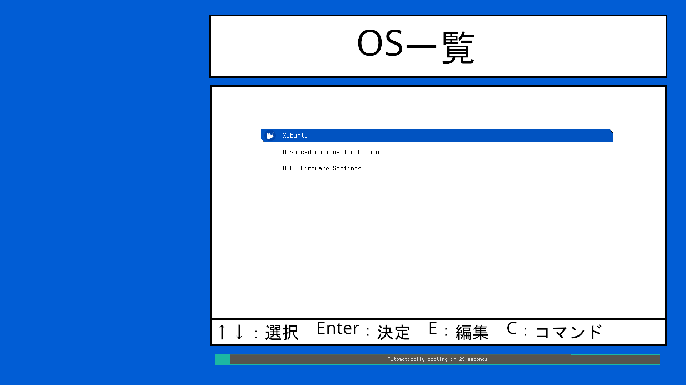
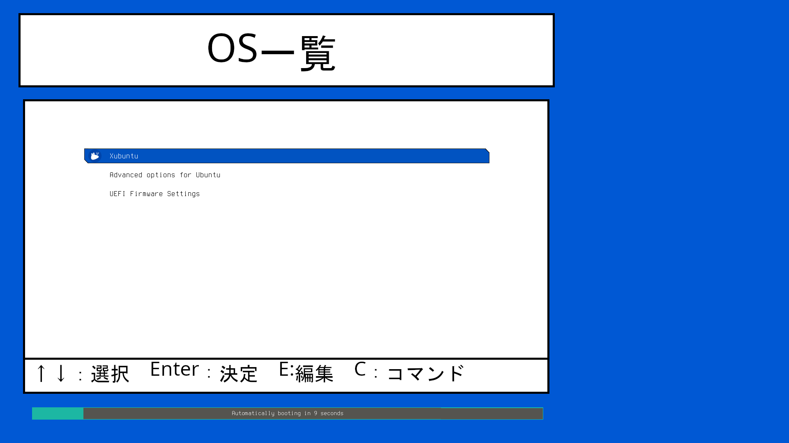
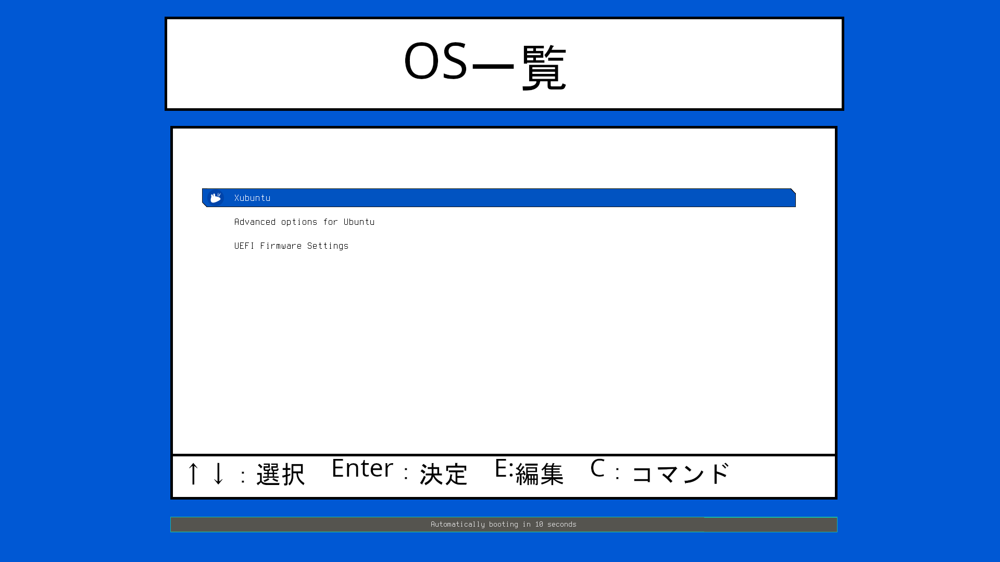

##

## :wrench: インストール方法(Linux環境で行います。)

- 端末を開きます。

- gitコマンドでこのリポジトリをクローンします。

    ```
    git clone https://github.com/ftmmchan/GRUB-Template.git
    ```

- ホームディレクトリにGRUB-Templateというフォルダがあると思うので中にあるbackground.pngなどの画像を適当に差し替えます。
    
   テーマのテンプレートは3種類用意しています。 
    
    
     
 - テーマをインストールします。

    ```
    cd GRUB-Template/Template_1
    #作業ディレクトリに移動
    ```
    ```
    sudo ./install.sh                
    #エラーが出る場合 
    sudo bash ./install.sh
    ```

- PCを再起動すれば反映されます。
 - 改変する場合。  
   フォルダ名がそのままテーマ名になりますので複製して好きなようにしてください。

 - アンインストールする場合。

    ```
    sudo ./uninstall.sh                
    #エラーが出る場合 
    sudo bash ./uninstall.sh
    ```

元の製作者：[Andi Trisna Mukti様](https://github.com/13atm01/GRUB-Theme)、[Vince様](https://github.com/vinceliuice/grub2-themes)
